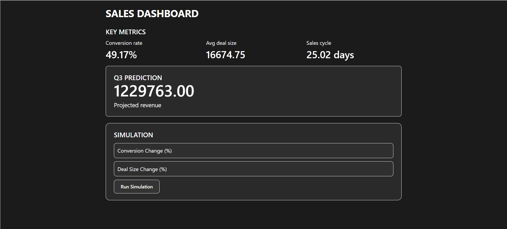
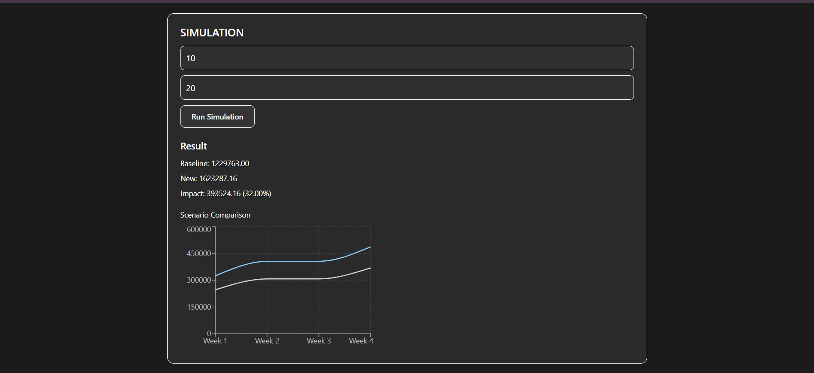

# Sales Dashboard & Simulation Tool

## About the Project

I built this project to understand how sales data can be analyzed and how small changes in business factors like conversion rate or deal size can affect overall revenue.
The idea was to take a CSV file with sales data, process it on the backend, and then show useful insights on the frontend. I also added a simulation feature where we can try different scenarios and see how revenue changes.
---
## video link: https://www.loom.com/share/5b623465c1664679a082e7fd4150490c

## What it does

* Reads sales data from a CSV file
* Divides data into Q1, Q2, Q3 based on dates
* Calculates:

  * Conversion rate
  * Average deal size
  * Sales cycle
* Predicts Q3 revenue using past data
* Lets the user simulate changes in:

  * conversion rate
  * deal size
* Shows how revenue changes (both value and percentage)
* Displays a simple chart to compare baseline vs new scenario

---

## Tech used

Frontend:

* React (with TypeScript)
* Tailwind CSS (for simple styling)
* Recharts (for the graph)

Backend:

* Node.js
* Express
* CSV file handling
* Typescript
---

## Folder Structure

```id="3n5l9y"
backend/
  src/
    index.ts
    services/
    utils/

frontend/
  src/
    components/
    App.tsx
```

---

## How to run

### Backend

```id="k1s6xq"
cd backend
npm install
npm run dev
```

Runs on:

```id="p4w8oj"
http://localhost:5000
```

---

### Frontend

```id="o4r7uj"
cd frontend
npm install
npm run dev
```

Runs on:

```id="d1xq8h"
http://localhost:5173
```

---

## API routes

* `/metrics` → returns calculated metrics
* `/predict` → gives Q3 revenue prediction
* `/simulate` → takes user input and shows new revenue + impact

---

## How simulation works (simple idea)

* First, it calculates baseline using Q1 and Q2
* Then it uses Q3 data to estimate revenue
* When user enters changes, it adjusts:

  * conversion rate
  * deal size
* Finally, it compares old vs new revenue

---

## Some things to note

* The CSV file is read every time an API is called, so if I change the data, it gets updated after refresh
* It’s not live updating automatically, but works on request
* I kept the UI simple and used only one chart as required

---
## Assumptions & Key Inferences

While building this project, I made a few assumptions to simplify the problem and focus on the main logic:

* I assumed that the CSV data is clean and has valid dates, deal values, and stages
* Only deals with stage **"Closed Won"** are considered for revenue calculations
* Conversion rate is calculated based on past data (Q1 + Q2) and assumed to be applicable for Q3
* The number of deals in Q3 is taken as fixed (based on available data), and only conversion rate and deal size affect revenue
* User inputs for simulation are treated as percentage changes (for example, 10 means +10%)
* If no input is given, the system uses baseline values

---

### Key Inferences

* Increasing conversion rate or deal size directly increases revenue, but the impact depends on how many deals exist in Q3
* Small percentage changes can still lead to significant revenue difference when deal volume is high
* Historical data (Q1 & Q2) can be used as a reasonable baseline for prediction, but it may not always reflect future trends
* This model is simplified and does not consider external factors like seasonality, market conditions, or customer behavior

---

### Limitations

* The system does not handle real-time updates automatically (requires refresh)
* No validation for incorrect or missing CSV data
* Prediction is based only on simple calculations, not advanced models
* Assumes uniform distribution of deals (no time-based variation inside Q3)

---
## Screenshots of the project



## What I learned from this

* How to work with CSV data in backend
* How to connect frontend with APIs
* Debugging issues like NaN, API errors, etc.
* Basic data visualization
* Structuring a small full-stack project

---

## If I had more time

* Improve UI a bit more
* Add file upload instead of fixed CSV
* Add real-time updates
* Maybe add login system

---

## Author

Kamakshi Aggarwal
